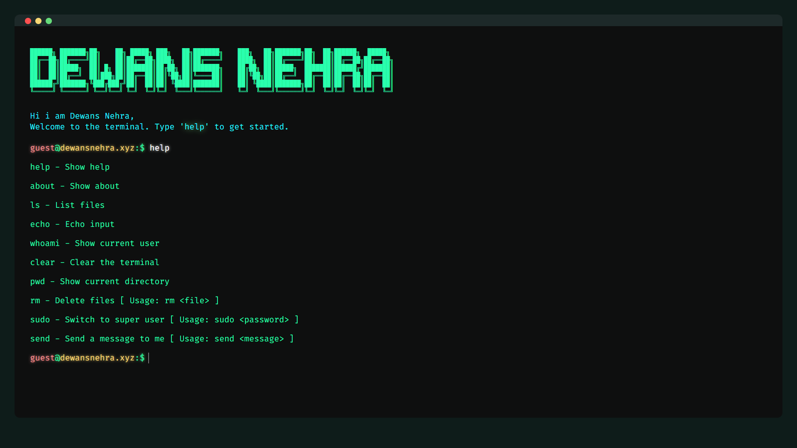

# Terminal Project

This project is a web-based terminal emulator. It's designed to be easy to use and customizable.

## Features

- Fully functional terminal emulator
- Customizable themes
- Mobile responsive design

## Usage

To use this terminal emulator, simply open the `index.html` file in your web browser.

## Contributing

Contributions are welcome! Please feel free to submit a Pull Request.

## License

This project is licensed under the MIT License.